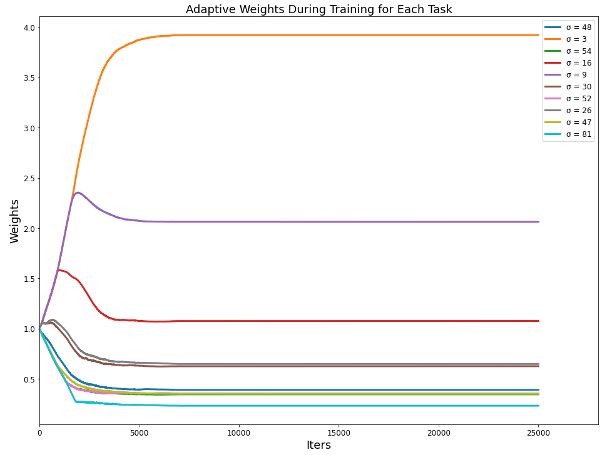

# PyTorch GradNorm

<p align="center"></p>

This is a PyTorch-based implementation of [GradNorm: Gradient normalization for adaptive loss balancing in deep multitask networks](http://proceedings.mlr.press/v80/chen18a.html), which is a gradient normalization algorithm that automatically balances training in deep multitask models by dynamically tuning gradient magnitudes.

The toy example can be found at [**here**](https://github.com/LucasBoTang/GradNorm/blob/main/Test.ipynb).


## Algorithm

<p align="center"></p>


## Dependencies

- [PyTorch](https://pytorch.org/)
- [NumPy](https://numpy.org/)


## Usage

### Parameters

- net: a multitask network with task loss
- layer: layers of the network layers where applying GradNorm on the weights
- alpha: hyperparameter of restoring force
- dataloader: training dataloader
- num_epochs: number of epochs
- lr1:  learning rate of multitask loss
- lr2:  learning rate of weights
- log:  flag of result log

### Sample Code

```python
from gradnorm import gradNorm
log_weights, log_loss = gradNorm(net=mtlnet, layer=net.fc4, alpha=0.12, dataloader=dataloader,
                                 num_epochs=100, lr1=1e-5, lr2=1e-4, log=False)
```

## Toy Example (from Original Paper)

### Data

Consider $T$ regression tasks trained using standard squared loss onto the functions:

$$
f_i (\mathbf{x}) = \sigma_i  \tanh \left( ( \mathbf{B} + \epsilon_i ) \mathbf{x} \right)
$$

Inputs are dimension 250 and outputs dimension 100, while $\mathbf{B}$ and $\epsilon_i$ are constant matrices with their elements generated IID from $N(0; 10)$ and $N(0; 3.5)$, respectively. Each task, therefore, shares information in B but also contains task-specific information $\epsilon_i$. The $\sigma_i$ sets the scales of the outputs.

```python
from data import toyDataset
dataset = toyDataset(num_data=10000, dim_features=250, dim_labels=100, scalars=[1,100])
```

### Model

A 4-layer fully-connected ReLU-activated network with 100 neurons per layer as a common trunk is used to train our toy example. A final affine transformation layer gives *T* final predictions.

<p align="center"></p>

```python
from model import fcNet, mtlNet
net = fcNet(dim_features=250, dim_labels=100, n_tasks=2) # fc net with multiple heads
mtlnet = mtlNet(net) # multitask net with task loss
```

### Result (10 Tasks)

<p align="center"></p>
